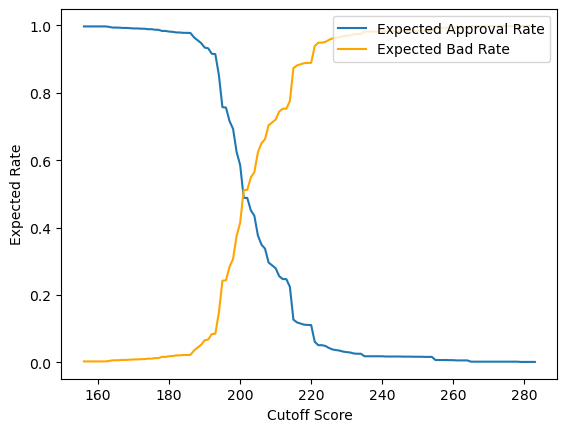

# **Background project**
---

In the company's banking division, there has been a default rate of 20% for credit. The company is interested in reducing this default rate using customer data. 
As data scientists, we have been tasked with creating analytics and machine learning models to help decrease the default rate, 
including identifying high-risk customers. We must proceed with caution when handling observational data.

# **Objective**
- Reduce default rates in the banking division
- Develop predictive models for identifying high-risk customers.
  
## **Step-by-step**
To obtain the best prediction in high-risk cases, what we must do? :
1. Data Preprocessing
2. Data Exploration
3. Check Correlation
4. Initial Characteristic Analysis
5. Design Score Card
6. Logistic Regression Modeling
7. Model Evaluation
8. Model Estimate
9. Scaling
10. Predict Credit Score

## **Result Model Prediction**
I'm using model logistic regression to decide using the data. Why use the model? Because the model can be simple to interpret.

- From model selection, we have the best logistic regression model that includes 4 predictors (`job`, `marital`, `education`, `default`).
- The sensitivity/recall score from the best model is about 0.63 on the train set and 0.65 test set, which means:
  - The model can predict about 65% of bad applicants correctly.
  - We still have a chance of about 25% to misclassify bads as goods.
- The best model may be questioned by other departments since the best model only contains 4 predictors.
  - Scorecards with too few characteristics are generally unable to withstand the test of time, as they are susceptible to minor changes in the applicant profile.
  - In business terms, scorecards should be developed to mimic the thought process of a seasoned, effective adjudicator or risk analyst. A good adjudicator will never look at just two or three things from an application form or account history to decide.


## **Observation Best Threshold Credit Scoring**
How can we choose a cut-off score?
- Estimate the expected approval rate from the test set.
- Estimate the expected bad rate from the train set.

Look at this image!



Now we can obtain a cut-off for rejecting under 200 and then approving more than 200.

**Testing for input:**
```python
input = {
    'default': 'yes',
    'job': 'entrepreneur',
    'marital': 'single',
    'education' : 'secondary'
}
```

```python
input_score = predict_score(raw_data = input_table,
                            cutoff_score = 200)
```

**Output**
```python
Credit Score :  169
Recommendation : REJECT
```

## Recommendation for business
- If we use automated machine learning, we can consider 4 data (`job`, `marital`, `education`, `default`), because testing statistics and coefficients have high values.

- If we did not use machine learning, we can consider 4 data, (`job`, `marital`, `education`, `default`)
  - `Job` not recommended for entrepreneur
  - `marital` not recommended for divorced
  - `education` not recommended for secondary
  - `default` not recommended for yes
    
*for detail you can enter into `code_analysis`*

